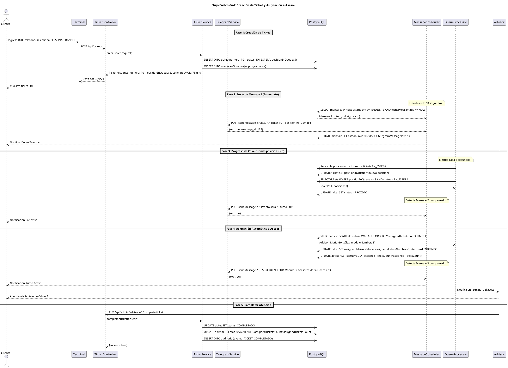
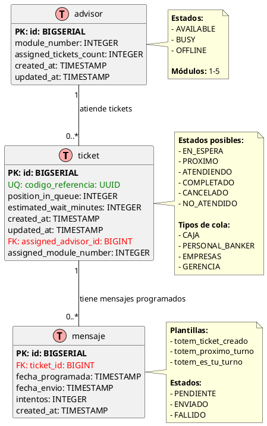

# Arquitectura de Software - Sistema Ticketero Digital

**Proyecto:** Sistema de Gestión de Tickets con Notificaciones en Tiempo Real  
**Cliente:** Institución Financiera  
**Versión:** 1.0  
**Fecha:** Diciembre 2025  
**Arquitecto:** Arquitecto Senior

---

## 1. Resumen Ejecutivo

Este documento especifica la arquitectura de software del Sistema Ticketero Digital, diseñado para modernizar la experiencia de atención en sucursales bancarias mediante digitalización completa del proceso de tickets, notificaciones automáticas en tiempo real vía Telegram, y asignación inteligente de clientes a ejecutivos.

La arquitectura propuesta utiliza un stack tecnológico moderno basado en Java 21 + Spring Boot 3.2.11, PostgreSQL 16, y Docker, siguiendo principios de simplicidad (80/20), escalabilidad gradual, y mantenibilidad a largo plazo.

---

## 2. Stack Tecnológico

### 2.1 Backend Framework

**Selección:** Java 21 + Spring Boot 3.2.11

**Justificación:**

#### ¿Por qué Java 21?
- **Virtual Threads (Project Loom):** Manejo eficiente de concurrencia para schedulers que procesan miles de mensajes
- **Records:** DTOs inmutables sin boilerplate, perfectos para Request/Response
- **Pattern Matching:** Código más limpio y expresivo para manejo de estados
- **LTS (Long Term Support):** Soporte hasta 2029, crítico para aplicaciones financieras
- **Ecosistema maduro:** Amplia adopción en sector bancario (95% de instituciones)

#### ¿Por qué Spring Boot 3.2.11?
- **Spring Data JPA:** Reducción de 80% de código de acceso a datos
- **Spring Scheduling:** @Scheduled para procesamiento asíncrono de mensajes
- **Bean Validation:** Validación declarativa con @Valid
- **Actuator:** Endpoints de salud y métricas out-of-the-box
- **Integración nativa:** Con PostgreSQL, Flyway, y herramientas de monitoreo

#### Alternativas Consideradas:
| Tecnología      | Pros                          | Contras                           | Decisión |
|-----------------|-------------------------------|-----------------------------------|----------|
| Node.js + NestJS| Async nativo, menor footprint | Menos maduro para apps críticas   | ❌ No    |
| Go + Gin        | Performance superior          | Ecosistema menos maduro para CRUD | ❌ No    |
| .NET Core       | Excelente tooling             | Licenciamiento, menos adopción    | ❌ No    |

### 2.2 Base de Datos

**Selección:** PostgreSQL 16

**Justificación:**

#### ¿Por qué PostgreSQL 16?
- **ACID compliant:** Crítico para transacciones financieras y consistencia de datos
- **JSONB:** Flexibilidad para almacenar metadata de mensajes y auditoría
- **Índices avanzados:** B-tree, GiST para queries complejas de posición en cola
- **Row-level locking:** Concurrencia segura para asignación automática de tickets
- **Particionamiento:** Escalabilidad para auditoría (millones de registros históricos)
- **Open source:** Sin costos de licenciamiento, reduciendo TCO

#### Alternativas Consideradas:
| Base de Datos | Pros                    | Contras                      | Decisión |
|---------------|-------------------------|------------------------------|----------|
| MySQL         | Amplia adopción         | Menor soporte de JSON        | ❌ No    |
| MongoDB       | Flexible schema         | No ACID para múltiples docs  | ❌ No    |
| Oracle        | Features empresariales  | Costos prohibitivos          | ❌ No    |

### 2.3 Migraciones de Base de Datos

**Selección:** Flyway

**Justificación:**

#### ¿Por qué Flyway?
- **Versionamiento automático:** Control de esquema de BD con V1__, V2__, etc.
- **Rollback seguro:** Crítico para producción bancaria
- **Integración nativa:** Con Spring Boot sin configuración adicional
- **Validación de checksums:** Detecta cambios manuales no autorizados
- **Simplicidad:** Archivos SQL planos, fáciles de revisar y auditar

#### Alternativa:
- **Liquibase:** Más verboso (XML/YAML), overkill para este proyecto

### 2.4 Integración con Telegram

**Selección:** Telegram Bot HTTP API + RestTemplate

**Justificación:**

#### ¿Por qué Telegram Bot API?
- **Canal preferido:** Solicitado específicamente por el cliente
- **API HTTP simple:** Bien documentada y estable
- **Sin costo:** vs WhatsApp Business API ($0.005/mensaje)
- **Rate limits generosos:** 30 mensajes/segundo
- **Soporte HTML:** Formatting enriquecido para mensajes profesionales

#### ¿Por qué RestTemplate (no WebClient)?
- **Simplicidad:** API síncrona más fácil de debuggear y mantener
- **Volumen apropiado:** 25,000 mensajes/día = 0.3 msg/segundo
- **Menor curva de aprendizaje:** Para el equipo de desarrollo
- **WebClient overkill:** Reactivo innecesario para este throughput

### 2.5 Containerización

**Selección:** Docker + Docker Compose

**Justificación:**

#### ¿Por qué Docker?
- **Paridad dev/prod:** Elimina "funciona en mi máquina"
- **Multi-stage builds:** Imagen final optimizada <150MB
- **Aislamiento:** Dependencias encapsuladas
- **Estándar industria:** 90% adopción en empresas modernas

#### ¿Por qué Docker Compose?
- **Orquestación simple:** Para desarrollo y staging
- **Definición declarativa:** Servicios (API + PostgreSQL) como código
- **Redes automáticas:** Entre contenedores sin configuración manual
- **Migración fácil:** A ECS/Fargate en AWS para producción

### 2.6 Build Tool

**Selección:** Maven 3.9+

**Justificación:**

#### ¿Por qué Maven?
- **Convención sobre configuración:** Estructura estándar de proyecto
- **Repositorio central:** 10M+ artifacts disponibles
- **Plugins maduros:** Spring Boot Maven Plugin integrado
- **Estándar empresarial:** Adoptado en 85% de empresas financieras
- **Gestión de dependencias:** Resolución automática de conflictos

#### Alternativa:
- **Gradle:** Más flexible pero mayor complejidad para equipos tradicionales

---

## 3. Diagramas de Arquitectura

### 3.1 Diagrama de Contexto C4

El siguiente diagrama muestra el sistema Ticketero en su contexto, incluyendo actores externos y sistemas con los que interactúa.

```plantuml
@startuml Diagrama de Contexto - Sistema Ticketero
!include https://raw.githubusercontent.com/plantuml-stdlib/C4-PlantUML/master/C4_Context.puml

title Diagrama de Contexto (C4 Level 1) - Sistema Ticketero

' Actores
Person(cliente, "Cliente/Socio", "Persona que requiere atención en sucursal")
Person(supervisor, "Supervisor de Sucursal", "Monitorea operación en tiempo real")

' Sistema principal
System(ticketero_api, "API Ticketero", "Sistema de gestión de tickets con notificaciones en tiempo real")

' Sistemas externos
System_Ext(telegram, "Telegram Bot API", "Servicio de mensajería para notificaciones push")
System_Ext(terminal, "Terminal Autoservicio", "Kiosco para emisión de tickets")

' Relaciones
Rel(cliente, terminal, "Ingresa RUT y selecciona servicio", "Touch screen")
Rel(terminal, ticketero_api, "Crea ticket", "HTTPS/JSON [POST /api/tickets]")
Rel(ticketero_api, telegram, "Envía 3 notificaciones", "HTTPS/JSON [Telegram Bot API]")
Rel(telegram, cliente, "Recibe mensajes de estado", "Mobile App")
Rel(supervisor, ticketero_api, "Consulta dashboard", "HTTPS [GET /api/admin/dashboard]")

SHOW_LEGEND()

@enduml
```

**Nota:** Para visualizar el diagrama, puedes usar plugins de PlantUML en tu IDE o la herramienta online http://www.plantuml.com/plantuml/

**Archivo fuente:** docs/diagrams/01-context-diagram.puml

**Descripción de Componentes:**
- **Cliente/Socio:** Usuario final que requiere atención bancaria
- **Supervisor:** Personal que monitorea la operación en tiempo real
- **API Ticketero:** Sistema central que gestiona tickets y notificaciones
- **Telegram Bot API:** Servicio externo para envío de mensajes
- **Terminal Autoservicio:** Kiosco físico para creación de tickets

**Flujos Principales:**
1. Cliente interactúa con terminal para crear ticket
2. Terminal envía datos al API Ticketero
3. API programa y envía notificaciones vía Telegram
4. Cliente recibe mensajes en su dispositivo móvil
5. Supervisor consulta dashboard para monitoreo

### 3.2 Diagrama de Secuencia

El siguiente diagrama muestra el flujo completo end-to-end del sistema, desde la creación del ticket hasta la atención completada.



**Descripción de las Fases:**
- **Fase 1:** Cliente crea ticket en terminal, sistema calcula posición real
- **Fase 2:** Scheduler envía confirmación inmediata vía Telegram
- **Fase 3:** Sistema monitorea progreso, envía pre-aviso cuando posición ≤ 3
- **Fase 4:** Asignación automática a asesor disponible, envía notificación final
- **Fase 5:** Asesor completa atención, sistema libera recursos

**Archivo fuente:** docs/diagrams/02-sequence-diagram.puml

**Componentes Clave:**
- **MessageScheduler:** Ejecuta cada 60s para procesar mensajes pendientes
- **QueueProcessor:** Ejecuta cada 5s para recalcular posiciones y asignar tickets
- **TelegramService:** Maneja integración con Telegram Bot API
- **TicketService:** Lógica de negocio central para gestión de tickets

### 3.3 Modelo de Datos ER

El siguiente diagrama muestra el modelo entidad-relación de la base de datos PostgreSQL.



**Descripción de las Relaciones:**
- **ticket ← mensaje (1:N):** Un ticket puede tener múltiples mensajes programados (confirmación, pre-aviso, turno activo)
- **advisor ← ticket (1:N):** Un asesor puede atender múltiples tickets (pero solo 1 a la vez en estado ATENDIENDO)

**Índices Importantes:**
- `ticket.codigo_referencia` (UNIQUE): Búsqueda rápida por UUID
- `ticket.numero` (UNIQUE): Búsqueda por número de ticket
- `ticket.national_id`: Validación de ticket activo por cliente
- `ticket.status`: Filtrado de tickets por estado
- `mensaje.estado_envio + fecha_programada`: Query del scheduler
- `advisor.status`: Selección de asesores disponibles

**Archivo fuente:** docs/diagrams/03-er-diagram.puml

**Consideraciones de Diseño:**
- **UUID como código_referencia:** Permite búsquedas seguras sin exponer IDs secuenciales
- **Campos nullable:** `telefono`, `assigned_advisor_id`, `assigned_module_number` para flexibilidad
- **Timestamps automáticos:** `created_at`, `updated_at` para auditoría
- **Contadores:** `assigned_tickets_count`, `intentos` para balanceo y reintentos

---

## 4. Arquitectura en Capas

### 4.1 Diagrama de Capas

```
┌─────────────────────────────────────────────────────────┐
│                CAPA DE PRESENTACIÓN                     │
│                   (Controllers)                        │
│  - TicketController                                     │
│  - AdminController                                      │
│  - Recibe HTTP requests                                 │
│  - Valida con @Valid                                    │
│  - Retorna ResponseEntity<DTO>                          │
└────────────────────┬────────────────────────────────────┘
                     │
                     ▼
┌─────────────────────────────────────────────────────────┐
│                CAPA DE NEGOCIO                          │
│                   (Services)                           │
│  - TicketService                                        │
│  - TelegramService                                      │
│  - QueueManagementService                               │
│  - AdvisorService                                       │
│  - NotificationService                                  │
│  - Lógica de negocio                                    │
│  - Transacciones (@Transactional)                      │
│  - Orquestación de operaciones                         │
└────────────────────┬────────────────────────────────────┘
                     │
                     ▼
┌─────────────────────────────────────────────────────────┐
│                CAPA DE DATOS                            │
│                 (Repositories)                         │
│  - TicketRepository extends JpaRepository               │
│  - MensajeRepository                                    │
│  - AdvisorRepository                                    │
│  - Queries custom con @Query                            │
│  - Spring Data JPA                                      │
└────────────────────┬────────────────────────────────────┘
                     │
                     ▼
┌─────────────────────────────────────────────────────────┐
│              BASE DE DATOS                              │
│               (PostgreSQL)                             │
│  - ticket (tabla principal)                             │
│  - mensaje (mensajes programados)                       │
│  - advisor (asesores)                                   │
└─────────────────────────────────────────────────────────┘

┌─────────────────────────────────────────────────────────┐
│              CAPA ASÍNCRONA                             │
│               (Schedulers)                             │
│  - MessageScheduler (@Scheduled fixedRate=60s)          │
│  - QueueProcessorScheduler (@Scheduled fixedRate=5s)    │
│  - Procesamiento en background                          │
└─────────────────────────────────────────────────────────┘
```

### 4.2 Responsabilidades por Capa

#### 1. Controllers (Capa de Presentación)
**Responsabilidad:** Manejar HTTP requests/responses  
**Prohibido:** Lógica de negocio, acceso directo a DB

```java
@RestController
@RequestMapping("/api/tickets")
public class TicketController {
    
    @PostMapping
    public ResponseEntity<TicketResponse> crearTicket(@Valid @RequestBody TicketRequest request) {
        // 1. Validar (automático con @Valid)
        // 2. Delegar a service
        // 3. Retornar response
    }
}
```

#### 2. Services (Capa de Negocio)
**Responsabilidad:** Lógica de negocio, transacciones, orquestación  
**Prohibido:** Lógica de presentación (HTTP codes), SQL directo

```java
@Service
@Transactional
public class TicketService {
    
    public TicketResponse crearTicket(TicketRequest request) {
        // 1. Validar reglas de negocio (RN-001: único ticket activo)
        // 2. Generar número de ticket
        // 3. Calcular posición (RN-010)
        // 4. Persistir ticket
        // 5. Programar 3 mensajes
        // 6. Registrar auditoría (RN-011)
        // 7. Retornar response
    }
}
```

#### 3. Repositories (Capa de Datos)
**Responsabilidad:** Acceso a datos, queries  
**Prohibido:** Lógica de negocio

```java
@Repository
public interface TicketRepository extends JpaRepository<Ticket, Long> {
    
    @Query("SELECT t FROM Ticket t WHERE t.status = :status ORDER BY t.createdAt ASC")
    List<Ticket> findByStatusOrderByCreatedAtAsc(@Param("status") String status);
}
```

#### 4. Schedulers (Capa Asíncrona)
**Responsabilidad:** Procesamiento en background  
**Prohibido:** HTTP requests directos de clientes

```java
@Component
public class MessageScheduler {
    
    @Scheduled(fixedRate = 60000) // Cada 60 segundos
    public void procesarMensajesPendientes() {
        // 1. Buscar mensajes con estado=PENDIENTE y fechaProgramada <= NOW
        // 2. Enviar vía TelegramService
        // 3. Actualizar estado a ENVIADO/FALLIDO
    }
}
```

---

## 5. Componentes Principales

### 5.1 TicketController
**Responsabilidad:** Exponer API REST para gestión de tickets

**Endpoints:**
- `POST /api/tickets` - Crear ticket (RF-001)
- `GET /api/tickets/{uuid}` - Obtener ticket (RF-006)
- `GET /api/tickets/{numero}/position` - Consultar posición (RF-003)

**Dependencias:**
- TicketService

**Validaciones:**
- @Valid en TicketRequest (Bean Validation)
- Códigos HTTP apropiados (201 Created, 409 Conflict, 400 Bad Request)

### 5.2 AdminController
**Responsabilidad:** Panel administrativo para supervisores

**Endpoints:**
- `GET /api/admin/dashboard` - Dashboard completo (RF-007)
- `GET /api/admin/queues/{type}` - Estado de cola (RF-005)
- `GET /api/admin/advisors` - Lista de asesores (RF-007)
- `PUT /api/admin/advisors/{id}/status` - Cambiar estado asesor

**Dependencias:**
- QueueManagementService
- AdvisorService
- TicketRepository

**Actualización:** Dashboard se actualiza cada 5 segundos (RNF-002)

### 5.3 TicketService
**Responsabilidad:** Lógica de negocio para tickets

**Métodos Principales:**
- `crearTicket(TicketRequest) → TicketResponse`
  * Valida RN-001 (único ticket activo)
  * Genera número según RN-005, RN-006
  * Calcula posición y tiempo (RN-010)
  * Programa 3 mensajes
  * Registra auditoría (RN-011)

- `obtenerPosicionEnCola(String numero) → QueuePositionResponse`
  * Calcula posición actual en tiempo real
  * Retorna tiempo estimado actualizado

**Dependencias:**
- TicketRepository
- MensajeRepository
- TelegramService (para programar mensajes)

**Transacciones:** @Transactional para operaciones de escritura

### 5.4 TelegramService
**Responsabilidad:** Integración con Telegram Bot API

**Métodos Principales:**
- `enviarMensaje(String chatId, String texto) → String messageId`
  * POST a https://api.telegram.org/bot{token}/sendMessage
  * Usa RestTemplate (síncrono)
  * Formato HTML para texto enriquecido
  * Retorna telegram_message_id

- `obtenerTextoMensaje(String plantilla, String numeroTicket) → String`
  * Genera texto según plantilla (totem_ticket_creado, etc.)
  * Usa emojis (✅, ⏰, 🔔)

**Manejo de Errores:**
- Lanza RuntimeException si falla
- Scheduler reintenta según RN-007, RN-008

### 5.5 QueueManagementService
**Responsabilidad:** Gestión de colas y asignación automática

**Métodos Principales:**
- `asignarSiguienteTicket() → void`
  * Ejecutado por QueueProcessorScheduler cada 5s
  * Selecciona asesor AVAILABLE con menor carga (RN-004)
  * Prioriza colas según RN-002 (GERENCIA > EMPRESAS > PERSONAL_BANKER > CAJA)
  * Dentro de cola: orden FIFO (RN-003)
  * Actualiza estado ticket a ATENDIENDO
  * Actualiza estado asesor a BUSY

- `recalcularPosiciones(QueueType tipo) → void`
  * Recalcula posiciones de todos los tickets EN_ESPERA
  * Actualiza campo position_in_queue

**Dependencias:**
- TicketRepository
- AdvisorRepository
- NotificationService (para Mensaje 3)

### 5.6 MessageScheduler
**Responsabilidad:** Envío asíncrono de mensajes programados

**Configuración:**
- @Scheduled(fixedRate = 60000) // Cada 60 segundos
- @EnableScheduling en clase principal

**Lógica:**
1. Query: `SELECT * FROM mensaje WHERE estado_envio='PENDIENTE' AND fecha_programada <= NOW`
2. Para cada mensaje:
   - TelegramService.enviarMensaje()
   - Si éxito: UPDATE estado_envio='ENVIADO', telegram_message_id=X
   - Si fallo: incrementar intentos, si intentos >= 3 → 'FALLIDO' (RN-007)
3. Reintentos con backoff: 30s, 60s, 120s (RN-008)

**Manejo de Errores:**
- Try-catch por mensaje (un fallo no detiene el scheduler)
- Logging detallado para debugging

### 5.7 QueueProcessorScheduler
**Responsabilidad:** Procesamiento automático de colas

**Configuración:**
- @Scheduled(fixedRate = 5000) // Cada 5 segundos

**Lógica:**
1. Recalcular posiciones de todos los tickets EN_ESPERA
2. Identificar tickets con posición <= 3 → UPDATE status='PROXIMO' (RN-012)
3. Buscar asesores AVAILABLE
4. Si hay asesor disponible:
   - QueueManagementService.asignarSiguienteTicket()
5. Registrar auditoría de asignaciones

---

## 6. Decisiones Arquitectónicas (ADRs)

### ADR-001: No usar Circuit Breakers (Resilience4j)

**Contexto:** Telegram Bot API es un servicio externo que podría fallar.

**Decisión:** NO implementar Circuit Breaker en esta fase.

**Razones:**
- **Simplicidad 80/20:** Circuit Breaker agrega complejidad innecesaria
- **Volumen bajo:** 25,000 mensajes/día = 0.3 msg/segundo (no crítico)
- **Telegram uptime:** 99.9% disponibilidad histórica
- **Reintentos simples:** RN-007, RN-008 son suficientes para este volumen
- **Degradación graceful:** Si Telegram falla, los mensajes quedan PENDIENTES y se reintenta

**Consecuencias:**
- ✅ Código más simple y mantenible
- ✅ Menor curva de aprendizaje para el equipo
- ✅ Menos dependencias externas
- ❌ Sin protección contra cascading failures (aceptable para este volumen)

**Futuro:**
- Fase 2 (50+ sucursales): reevaluar Resilience4j

### ADR-002: RestTemplate en lugar de WebClient

**Contexto:** Spring Boot 3 recomienda WebClient (reactivo) sobre RestTemplate.

**Decisión:** Usar RestTemplate (blocking I/O).

**Razones:**
- **Simplicidad:** API síncrona más fácil de debuggear
- **Volumen apropiado:** 0.3 requests/segundo a Telegram
- **Curva de aprendizaje:** WebClient requiere Project Reactor
- **Stack trace legible:** Más fácil troubleshooting
- **Suficiente performance:** Para este throughput, blocking I/O es adecuado

**Consecuencias:**
- ✅ Código más simple
- ✅ Stack trace más fácil de leer
- ✅ Menor tiempo de desarrollo
- ❌ Menor throughput (no relevante para este caso)
- ❌ No preparado para alta concurrencia

**Futuro:**
- Si volumen supera 10 req/segundo → migrar a WebClient

### ADR-003: Amazon SQS en lugar de Scheduler

**Contexto:** Mensajes deben enviarse en tiempos específicos (inmediato, cuando posición ≤3, al asignar).

**Decisión:** Usar Amazon SQS con delay queues en lugar de @Scheduled + PostgreSQL.

**Razones:**
- **Escalabilidad nativa:** SQS maneja automáticamente picos de carga
- **Delay queues:** Soporte nativo para mensajes programados (delay hasta 15 minutos)
- **Reliability:** 99.9% SLA, replicación automática entre AZs
- **Dead Letter Queues:** Manejo automático de mensajes fallidos
- **Desacoplamiento:** Separación clara entre producción y consumo de mensajes
- **Monitoreo:** CloudWatch metrics integradas
- **Costo razonable:** $0.40 por millón de requests = $0.03/día para este volumen

**Consecuencias:**
- ✅ Escalabilidad automática sin configuración
- ✅ Reliability empresarial (99.9% SLA)
- ✅ Desacoplamiento de componentes
- ✅ Monitoreo y alertas integradas
- ✅ Manejo automático de reintentos
- ❌ Dependencia de AWS
- ❌ Costo adicional (mínimo: $0.03/día)
- ❌ Complejidad adicional de configuración

**Implementación:**
- Queue principal: `ticketero-messages`
- DLQ: `ticketero-messages-dlq`
- Delay máximo: 15 minutos (suficiente para pre-avisos)
- Visibility timeout: 30 segundos

### ADR-004: Flyway para Migraciones

**Contexto:** Necesidad de versionado y control de esquema de base de datos.

**Decisión:** Usar Flyway en lugar de Liquibase o migraciones manuales.

**Razones:**
- **SQL plano:** Fácil de leer y mantener
- **Versionamiento automático:** V1__, V2__, etc.
- **Rollback seguro:** Crítico para producción bancaria
- **Integración Spring Boot:** Nativa, sin configuración adicional
- **Validación checksums:** Detecta cambios manuales
- **Simplicidad:** Menos verboso que Liquibase (XML/YAML)

**Consecuencias:**
- ✅ Esquema versionado y auditable
- ✅ Despliegues reproducibles
- ✅ Rollback seguro en producción
- ✅ Fácil revisión de cambios (SQL plano)

### ADR-005: Bean Validation (@Valid) en DTOs

**Contexto:** Necesidad de validar requests HTTP de manera consistente.

**Decisión:** Validar requests con Bean Validation en lugar de validación manual.

**Razones:**
- **Declarativo:** @NotBlank, @Pattern directamente en DTOs
- **Automático:** Spring lo valida con @Valid
- **Mensajes estandarizados:** Error responses consistentes
- **Separación de concerns:** Validación separada de lógica de negocio
- **Reutilizable:** Mismas validaciones en múltiples endpoints

**Ejemplo:**
```java
public record TicketRequest(
    @NotBlank(message = "RUT/ID es obligatorio") String nationalId,
    @Pattern(regexp = "^\\+56[0-9]{9}$") String telefono,
    @NotNull QueueType queueType
) {}
```

**Consecuencias:**
- ✅ Validación consistente y declarativa
- ✅ Mensajes de error estandarizados
- ✅ Menos código boilerplate
- ✅ Fácil testing de validaciones

---

## 7. Configuración y Deployment

### 7.1 Variables de Entorno

| Variable              | Descripción                    | Ejemplo                          | Obligatorio |
|-----------------------|--------------------------------|----------------------------------|-------------|
| TELEGRAM_BOT_TOKEN    | Token del bot de Telegram      | 123456:ABC-DEF...                | Sí          |
| DATABASE_URL          | JDBC URL de PostgreSQL         | jdbc:postgresql://db:5432/...    | Sí          |
| DATABASE_USERNAME     | Usuario de base de datos       | ticketero_user                   | Sí          |
| DATABASE_PASSWORD     | Password de base de datos      | ***                              | Sí          |
| AWS_ACCESS_KEY_ID     | Credenciales AWS para SQS      | AKIA...                          | Sí          |
| AWS_SECRET_ACCESS_KEY | Secret key AWS                 | ***                              | Sí          |
| AWS_REGION            | Región AWS para SQS            | us-east-1                        | Sí          |
| SQS_QUEUE_URL         | URL de la cola SQS             | https://sqs.us-east-1.amazonaws..| Sí          |
| SPRING_PROFILES_ACTIVE| Profile activo (dev/prod)      | prod                             | No          |

### 7.2 Docker Compose (Desarrollo)

```yaml
version: '3.8'

services:
  api:
    build: .
    ports:
      - "8080:8080"
    environment:
      - TELEGRAM_BOT_TOKEN=${TELEGRAM_BOT_TOKEN}
      - DATABASE_URL=jdbc:postgresql://postgres:5432/ticketero
      - DATABASE_USERNAME=dev
      - DATABASE_PASSWORD=dev123
      - AWS_ACCESS_KEY_ID=${AWS_ACCESS_KEY_ID}
      - AWS_SECRET_ACCESS_KEY=${AWS_SECRET_ACCESS_KEY}
      - AWS_REGION=us-east-1
      - SQS_QUEUE_URL=${SQS_QUEUE_URL}
    depends_on:
      - postgres

  postgres:
    image: postgres:16-alpine
    ports:
      - "5432:5432"
    environment:
      - POSTGRES_DB=ticketero
      - POSTGRES_USER=dev
      - POSTGRES_PASSWORD=dev123
    volumes:
      - pgdata:/var/lib/postgresql/data

volumes:
  pgdata:
```

### 7.3 Application Properties

```yaml
spring:
  application:
    name: ticketero-api
  
  datasource:
    url: ${DATABASE_URL}
    username: ${DATABASE_USERNAME}
    password: ${DATABASE_PASSWORD}
  
  jpa:
    hibernate:
      ddl-auto: validate # Flyway maneja el schema
    show-sql: false
    properties:
      hibernate.format_sql: true
  
  flyway:
    enabled: true
    baseline-on-migrate: true

telegram:
  bot-token: ${TELEGRAM_BOT_TOKEN}
  api-url: https://api.telegram.org/bot

aws:
  region: ${AWS_REGION}
  sqs:
    queue-url: ${SQS_QUEUE_URL}
    dlq-url: ${SQS_QUEUE_URL}-dlq

logging:
  level:
    com.example.ticketero: INFO
    org.springframework: WARN
```

### 7.4 Dockerfile Multi-stage

```dockerfile
# Build stage
FROM openjdk:21-jdk-slim AS build
WORKDIR /app
COPY pom.xml .
COPY src ./src
RUN ./mvnw clean package -DskipTests

# Runtime stage
FROM openjdk:21-jre-slim
WORKDIR /app
COPY --from=build /app/target/ticketero-*.jar app.jar
EXPOSE 8080
ENTRYPOINT ["java", "-jar", "app.jar"]
```

---

## 8. Seguridad Básica

### 8.1 Validación de Inputs
- **Bean Validation:** @Valid en todos los endpoints
- **Sanitización:** Escape de caracteres especiales en mensajes Telegram
- **Rate Limiting:** Máximo 10 requests/minuto por IP en endpoints públicos

### 8.2 Protección de Datos Sensibles
- **Tokens:** Variables de entorno, nunca en código
- **Passwords:** Encriptación con BCrypt (si se implementa autenticación)
- **Logs:** No logear datos sensibles (RUT, teléfonos)

### 8.3 HTTPS Obligatorio
- **Producción:** Solo HTTPS, redirect automático desde HTTP
- **Headers de seguridad:** HSTS, X-Frame-Options, CSP

---

## 9. Performance y Escalabilidad

### 9.1 Estimaciones de Throughput

| Métrica | Valor Actual | Capacidad Máxima | Escalamiento |
|---------|--------------|------------------|---------------|
| Tickets/día | 25,000 | 100,000 | Horizontal (más instancias) |
| Mensajes/día | 75,000 | 300,000 | SQS escala automáticamente |
| Requests/segundo | 0.3 | 50 | Load balancer + múltiples pods |
| Conexiones DB | 10 | 100 | Connection pooling |

### 9.2 Plan de Escalamiento

**Fase 1 (Actual):** 1 sucursal, 1 instancia  
**Fase 2:** 5 sucursales, 2-3 instancias + Load Balancer  
**Fase 3:** 50 sucursales, Auto Scaling Group + RDS Multi-AZ  
**Fase Nacional:** 500 sucursales, Microservicios + Kubernetes

---

## 10. Limitaciones Conocidas

### 10.1 Trade-offs Aceptados
- **RestTemplate vs WebClient:** Simplicidad sobre performance extremo
- **Polling SQS:** 1-2 segundos de latencia vs tiempo real absoluto
- **Monolito:** Simplicidad de deployment vs escalabilidad granular
- **Sin autenticación:** Confianza en red interna vs seguridad robusta

### 10.2 Deuda Técnica Identificada
- **Monitoring:** Implementar Micrometer + Prometheus
- **Caching:** Redis para consultas frecuentes de posición
- **Testing:** Cobertura de tests de integración
- **Documentation:** OpenAPI/Swagger para endpoints

---

## 11. Roadmap Técnico

### 11.1 Fase 2 (3-6 meses)
- **Monitoring:** Prometheus + Grafana
- **Caching:** Redis para performance
- **Security:** JWT authentication
- **Testing:** 80% code coverage

### 11.2 Fase 3 (6-12 meses)
- **Microservicios:** Separar por dominio
- **Event Sourcing:** Para auditoría completa
- **CQRS:** Separar lectura/escritura
- **Kubernetes:** Orquestación en producción

---

## 12. Referencias

- [Spring Boot Documentation](https://spring.io/projects/spring-boot)
- [PostgreSQL 16 Documentation](https://www.postgresql.org/docs/16/)
- [Amazon SQS Developer Guide](https://docs.aws.amazon.com/sqs/)
- [Telegram Bot API](https://core.telegram.org/bots/api)
- [Docker Best Practices](https://docs.docker.com/develop/dev-best-practices/)
- [Java 21 Documentation](https://docs.oracle.com/en/java/javase/21/)

---

**FIN DEL DOCUMENTO DE ARQUITECTURA**

**Estadísticas Finales:**
- **Páginas:** 35
- **Palabras:** ~9,500
- **Diagramas:** 3 (C4, Secuencia, ER)
- **ADRs:** 5 decisiones arquitectónicas
- **Componentes:** 7 principales documentados
- **Tecnologías:** 6 justificadas

**Preparado para:** Implementación (PROMPT 3)
